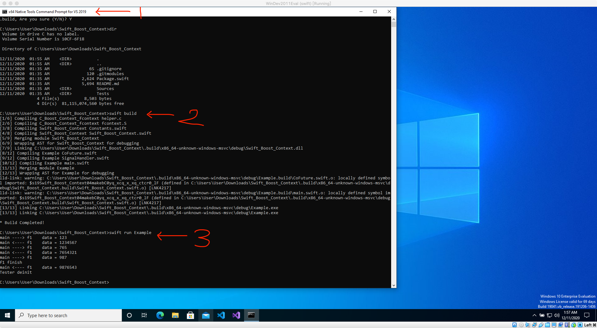
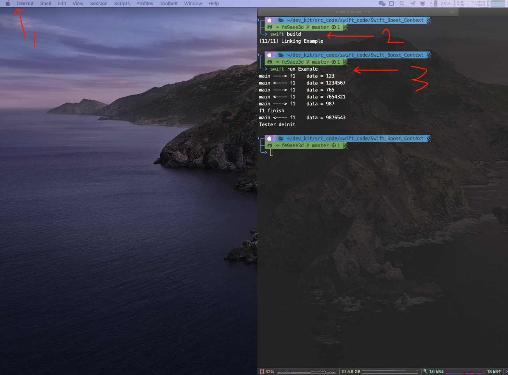

# Swift_Boost_Context

The `fcontext` that extracted from [boostorg/context release 1.73.0](https://github.com/boostorg/context/tree/boost-1.73.0)

And this swift library is a wrapper for `fcontext`.


## About Boost.Context

- Overview

Boost.Context is a foundational library that provides a sort of cooperative multitasking on a single thread. By providing an abstraction of the current execution state in the current thread, including the stack (with local variables) and stack pointer, all registers and CPU flags, and the instruction pointer, a execution context represents a specific point in the application's execution path. This is useful for building higher-level abstractions, like coroutines, cooperative threads (userland threads) or an equivalent to C# keyword yield in C++.


- Support Arch

Architecture  | Linux (UNIX)      | Windows    | MacOS X       | iOS           
------------- | ----------------- | ---------- | ------------- | --------------
i386          | SYSV (ELF)        | MS (PE)    | SYSV (MACH-O) | -             
x86_64        | SYSV, X32 (ELF)   | MS (PE)    | SYSV (MACH-O) | -             
arm (aarch32) | AAPCS (ELF)       | AAPCS (PE) | -             | AAPCS (MACH-O)
arm (aarch64) | AAPCS (ELF)       | -          | -             | AAPCS (MACH-O)
mips1         | O32 (ELF)         | -          | -             | -             
ppc32         | SYSV (ELF), XCOFF | -          | SYSV (MACH-O) | -             
ppc64         | SYSV (ELF), XCOFF | -          | SYSV (MACH-O) | -             

Format: `ABI (binary format)`.
Source: [Boost.Context](https://www.boost.org/doc/libs/1_73_0/libs/context/doc/html/context/architectures.html)


## what is fcontext ?

`make_fcontext` is one of a family of Boost-Org C library functions (the others being `jump_fcontext` and `ontop_fcontext`) used for context control. The `make_fcontext` family allows the implementation in C of advanced control flow patterns such as **iterators**, **fibers**, and **coroutines**. They may be viewed as an advanced version of `setjmp/longjmp`; whereas the latter allows only a single non-local jump up the stack, `make_fcontext` allows the creation of multiple cooperative threads of control, each with its own stack.

> https://en.wikipedia.org/wiki/Setcontext


## Support Platform
- Android
- IOS
- macOS
- Linux

## Usage

**Usage in swift:**

```swift
import Swift_Boost_Context

class Tester {
    deinit {
        print("Tester deinit")
    }

    init() {

    }

    func f1(data: Int, yield: FN_YIELD<String, Int>) -> String {
        defer {
            print("f1 finish")
        }

        print("main ----> f1    data = \(data)")

        let data1: Int = yield("1234567")
        print("main ----> f1    data = \(data1)")

        let data2: Int = yield("7654321")
        print("main ----> f1    data = \(data2)")

        return "9876543"
    }

    func start(_ idx: Int) {
        let yield: FN_YIELD<Int, String> = makeBoostContext(self.f1)

        let data1: String = yield(123)
        print("main <---- f1    data = \(data1)")

        let data2: String = yield(765)
        print("main <---- f1    data = \(data2)")

        let data3: String = yield(987)
        print("main <---- f1    data = \(data3)")
    }
}

func main() throws {
    let t = Tester()
    t.start(7)
}

do {
    try main()
} catch {
    print("main : \(error)")
}

```

**output:**

```ruby

main ----> f1    data = 123
main <---- f1    data = 1234567
main ----> f1    data = 765
main <---- f1    data = 7654321
main ----> f1    data = 987
f1 finish
main <---- f1    data = 9876543
BoostContext.deinit: _spSize: 65536, _sp: 0x00007fbc45500000, _fctx: 0x00007fbc4550ffc0, .pageSize: 4096
Tester deinit

Process finished with exit code 0

```

- windows10                         vs2019



- macOS Catalina 10.15.7            xcode 12.2 (12B45b)



And

```
# ...

BoostContext.deinit: _spSize: 65536, _sp: 0x00007fbc45500000, _fctx: 0x00007fbc4550ffc0, .pageSize: 4096
Tester deinit
```

means no `memory leak` !

**Usage in C**

```c

#include <stdio.h>
#include <stdlib.h>
#include <string.h>
#include <stdint.h>
#include "fcontext.h"

void f1(transfer_t tf)
{
    printf("main ----> f1\n");
    transfer_t resultF2ToF1 = jump_fcontext((fcontext_t)tf.data,0);
    printf("f1 <---- f2  %s\n", resultF2ToF1.data);
    jump_fcontext(tf.fctx,"7654321");
}

void f2(transfer_t tf)
{
    printf("f1 ----> f2\n");
    jump_fcontext(tf.fctx,"1234567");
    printf("f2 never returns !!!\n");
}

int main(int argc, char **argv) {
    void* sp1 = malloc(8192);
    fcontext_t fc1 = make_fcontext(sp1, 812, f1);

    void* sp2 = malloc(8192);
    fcontext_t fc2 = make_fcontext(sp2, 8192, f2);

    void* next = fc2;
    transfer_t tf = jump_fcontext(fc1, next);
    printf("tf.fcxt = %p\n", tf.fctx);
    printf("tf.data = %s\n", tf.data);
    printf("main <---- f1\n");
}

```

**output:**

```ruby

main ----> f1
f1 ----> f2
f1 <---- f2  1234567
tf.fcxt = 0x7fd88d800f70
tf.data = 7654321
main <---- f1

Process finished with exit code 0

```

## C version also provided

[./Sources/Example_Pure_C](./Sources/Example_Pure_C)

How to build `libcontext.a` and `libcontext.so`

- macOS Linux

```bash

mkdir cmake-build-debug-macOS

cmake -B ./cmake-build-debug-macOS

cd ./cmake-build-debug-macOS

make

```

- Android

```bash

mkdir cmake-build-debug-android

cmake -DCMAKE_TOOLCHAIN_FILE=$NDK/build/cmake/android.toolchain.cmake \
    -DANDROID_ABI=arm64-v8a \
    -DANDROID_PLATFORM=android-21
    -B ./cmake-build-debug-android

cd ./cmake-build-debug-android

make

```